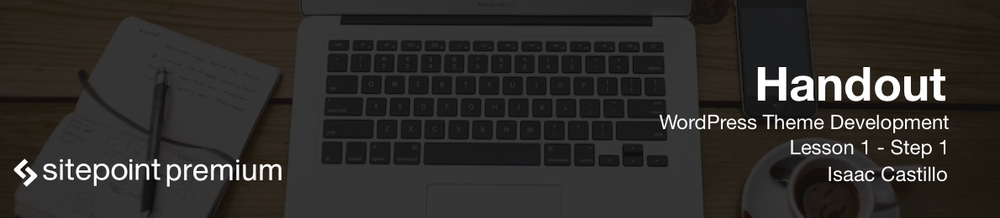

Hello guys, welcome to SitePoint's **WordPress Theme Creation** course!

In this course, we're going to discuss the ins and outs of creating our own WordPress theme. Not only will we discuss how to break these themes apart, but we'll discuss where those broken up pieces go. We'll also talk about the WordPress inner workings and how a theme actually loads.

And what parts of the theme gets loaded depending on what page type you visit.

So let's open up our editors, grab some caffeine, and get busy.

# Index for the WordPress Theme Development course

* [Lesson 1-1](WordPress_Theme_Development_handouts/lesson1-1.md)
* [Lesson 1-2](WordPress_Theme_Development_handouts/lesson1-2.md)
* [Lesson 1-3](WordPress_Theme_Development_handouts/lesson1-3.md)
* [Lesson 1-4](WordPress_Theme_Development_handouts/lesson1-4.md)
* [Lesson 2-1](WordPress_Theme_Development_handouts/lesson2-1.md)
* [Lesson 2-2](WordPress_Theme_Development_handouts/lesson2-2.md)
* [Lesson 2-3](WordPress_Theme_Development_handouts/lesson2-3.md)
* [Lesson 2-4](WordPress_Theme_Development_handouts/lesson2-4.md)
* [Lesson 2-5](WordPress_Theme_Development_handouts/lesson2-5.md)
* [Lesson 2-6](WordPress_Theme_Development_handouts/lesson2-6.md)
* [Lesson 2-7](WordPress_Theme_Development_handouts/lesson2-7.md)
* [Lesson 2-8](WordPress_Theme_Development_handouts/lesson2-8.md)
* [Lesson 3-1](WordPress_Theme_Development_handouts/lesson3-1.md)
* [Lesson 3-2](WordPress_Theme_Development_handouts/lesson3-2.md)
* [Lesson 3-3](WordPress_Theme_Development_handouts/lesson3-3.md)
* [Lesson 3-4](WordPress_Theme_Development_handouts/lesson3-4.md)
* [Lesson 3-5](WordPress_Theme_Development_handouts/lesson3-5.md)
* [Lesson 3-6](WordPress_Theme_Development_handouts/lesson3-6.md)
* [Lesson 3-7](WordPress_Theme_Development_handouts/lesson3-7.md)
* [Lesson 3-8](WordPress_Theme_Development_handouts/lesson3-8.md)
* [Lesson 4-1](WordPress_Theme_Development_handouts/lesson4-1.md)
* [Lesson 4-2](WordPress_Theme_Development_handouts/lesson4-2.md)
* [Lesson 4-3](WordPress_Theme_Development_handouts/lesson4-3.md)
* [Lesson 5-1](WordPress_Theme_Development_handouts/lesson5-1.md)
* [Lesson 5-2](WordPress_Theme_Development_handouts/lesson5-2.md)
* [Lesson 5-3](WordPress_Theme_Development_handouts/lesson5-3.md)
* [Lesson 5-4](WordPress_Theme_Development_handouts/lesson5-4.md)
* [Lesson 5-5](WordPress_Theme_Development_handouts/lesson5-5.md)
* [Lesson 5-6](WordPress_Theme_Development_handouts/lesson5-6.md)
* [Lesson 5-7](WordPress_Theme_Development_handouts/lesson5-7.md)
* [Lesson 6-1](WordPress_Theme_Development_handouts/lesson6-1.md)
* [Lesson 6-2](WordPress_Theme_Development_handouts/lesson6-2.md)
* [Lesson 6-3](WordPress_Theme_Development_handouts/lesson6-3.md)
* [Lesson 7-1](WordPress_Theme_Development_handouts/lesson7-1.md)
* [Lesson 7-2](WordPress_Theme_Development_handouts/lesson7-2.md)
* [Lesson 8-1](WordPress_Theme_Development_handouts/lesson8-1.md)
* [Lesson 8-2](WordPress_Theme_Development_handouts/lesson8-2.md)
