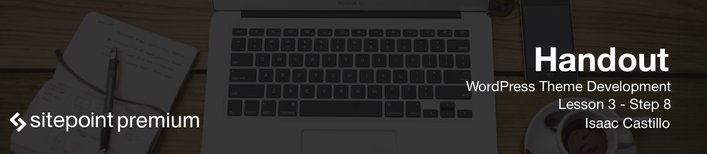

# Post Related Template Tags

In WordPress we have a great number of template tags that we can use.

You can see a full list of template tags here: [List of template tags](https://developer.wordpress.org/themes/references/list-of-template-tags/)

We have already covered some of these but some other tags to take note of are `the_content()`, `the_title()`, `the_excerpt()`, `get_search()`, `the_post_thumbnail()`.

## The Loop

It is worth noting that the following tags work within the loop. This is the main area that WordPress uses to extract all it's data and set it up for usage. As you go through the documentation you will see that the majority of tags we use will only work inside the loop. An example of the loop looks like below:

```
<?php if ( have_posts() ) : ?>
    <?php while ( have_posts() ) : the_post(); ?>
        ... Display post content or template tags
    <?php endwhile; ?>
<?php endif; ?>
```

Note that you will use the loop for any templates that have an archive of items and also for the single post/page templates as well.

## Template Tags

### the_content()

Calls the main body content of the blog post.

### the_title()

Calls the title of the blog post.

### the_excerpt()

Loads only a partial of the content. When you see a list of blog posts you usually see the ellipsis character (...) and then a read more buton to get the rest of the story. This function is responsible for that functionality.

### get_search

Calls the `search.php` file that has the input field and button.

### the\_post_thumbnail()

Calls the featured image that we have for the post. We pass the size we want and any additional attributes. The are general sizes that WordPress provides or we can create our own in the `functions.php` file.

See: [function calls with sizing](https://developer.wordpress.org/reference/functions/the_post_thumbnail/#comment-1026)

## Some differences to note

WordPress gives use `the_title()` and `get_the_title()` to work with. The difference is that `the_title()` prints out (echos) the title while `get_the_title()` will return it as a value till we are ready to do something with it.

## Conditional Tags

Some other things to learn is that WordPress gives us a great number of conditional tags that will let us know about the current items, state and/or page. These conditionals will return a boolean for us to test against. Some of these are listed below.

- is\_user\_logged_in()
- is\_home() [The home page of the blog landing]
- is\_front_page() [The front home landing page]
- is_single() [If we are on a single blog post page]

See other conditional tags: [Conditional](https://developer.wordpress.org/themes/basics/conditional-tags/)

### Example usage

```
if(is_home_page()) {
  // Then do something
}
```
