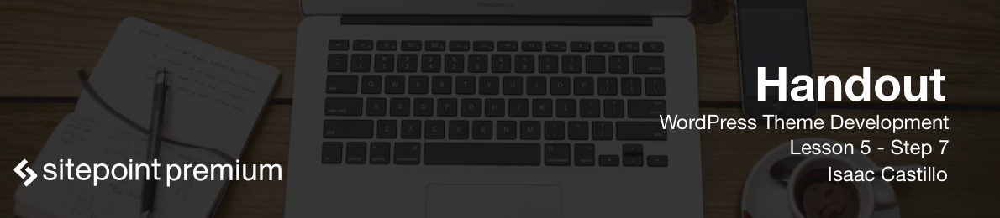
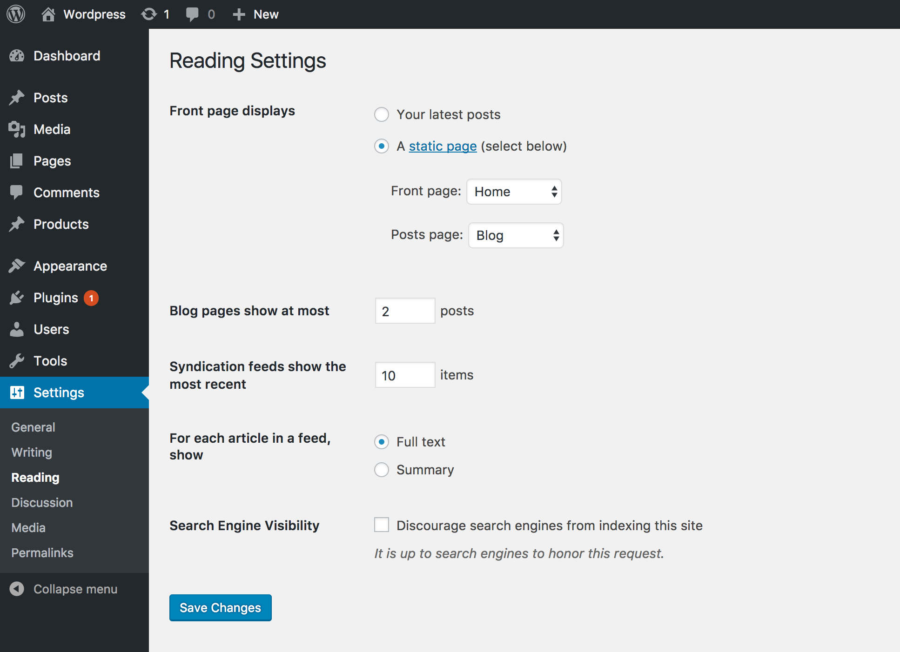

# Pagination

Pagination is paging for our blog posts. It would be hard or at least overwhelming to have 200 blog posts on one page. So we intro pagination to give the user the ability to page through the blog posts depending on how many we want them to see at any given time.

## Pagination settings

In the dashboard you can set how many blog posts you want to display on each page. Go to Settings > Reading and you will see something that says "Blog pages show at most" with a numerical value to change this.



## Pagination code

So pagination can get complicated but at it's simplest form we can introduce it into our sites with the following lines.

```
<div class="nav-previous pull-left"><?php next_posts_link( '<< Previous' ); ?></div>
<div class="nav-next pull-right"><?php previous_posts_link( 'Next >>' ); ?></div>
```
Inside the quotes we can pass any text to it that we want to display. Whe would place this after the loop and WordPress will do the calculations needed to produce the links that take you to the next or previous pages. If the number of posts are less than the number that is set in our settings then no links will show.

