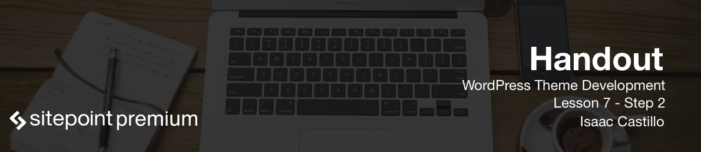

# Set the permalinks

On the initial install you will see that when we visit a post and a page the url up at the top will look like `somedomain.com/?p=234`. Although this may be acceptable for you, it would probably be best to have something that is easy to remember and something that helps a little with SEO (Search Engine Optimization).

## Pretty URLS

Pretty urls are easy to remember, describe the page a little better and are easy to implement. A pretty url for a blog titled `7 Reasons to Learn WordPress` is changed in our system to `7-reasons-to-learn-wordpress`. But we have to tell WordPress this is what we want. In the admin areay you need to go to `Settings > Permalinks` and you will see a list of available options. The option we are going to choose for this project is going to be `Post name`.

After that selection all your pages and posts will have pretty urls. So instead of having an about page say `?p=234` it will now say `somedomain.com/about`. You can even change this urls called `slugs` when you are editing that page or post.

